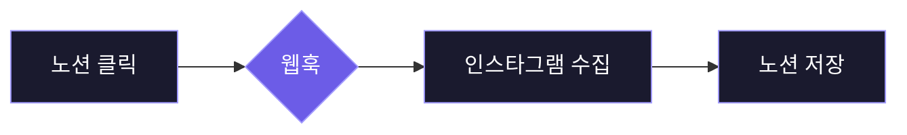

#에어테이블 #Airtable #노션 #Notion #n8n #크롤링 #인스타그램 #스크래퍼 #Apify 
#감성분석 #옵시디언 #Obsidian 



## <font color="#ffc000">에어테이블 vs 노션</font>
### <font color="#ffc000">에어테이블과 노션의 차이</font>
1. **에어테이블**
    - 정형 데이터의 왕 - 엑셀의 진화형
    - 표 형식의 구조화된 데이터 처리에 특화
    - 반복 패턴이 있는 데이터 관리에 강점
    - 통계와 집계가 필요한 업무에 최적화

2. **노션**
	- 비정형 데이터의 혁신 - 문서와 데이터베이스의 융합
	- 자유로운 형식의 콘텐츠를 데이터로 변환
	- 창의적 사고와 구조적 정리를 동시에 지원
	- 지식 작업자의 모든 정보를 한 곳에서 관리

3. **핵심 차별점**
	- 데이터를 바라보는 관점의 차이
	- **에어테이블:** 레코드
		- 한 줄의 데이터 (테이블 → 행 → 셀)
		- 데이터의 일관성과 무결성 중시
	- **노션:** 블록
		- 모든 것이 블록 (페이지 → 블록 → 블록)
		- 텍스트, 이미지, 데이터베이스 모두 동일한 블록
		- 레고처럼 조립하고 재구성 가능한 구조

4. **지식 그래프 확장**
	- 페이지 간 양방향 링크와 멘션(@)으로 관계형 DB 구축
	- 노션 에이전트 등장으로 인해 지식 DB 자유로운 활용 가능
## <font color="#ffc000">지식 베이스 구축 워크플로우</font>

### <font color="#ffc000">Trigger</font>
1. **On webhook call**
	- HTTP Method - POST
	- Path - n8n에서 자동 생성
	- Authentication - None 
	- Respond - Immediately
	- Options - Add option
		- Response Headers - Add Response Headers
		- Name - `Content-Type`
		- Vaule - `application/json`

2. **Notion:** 데이터베이스 생성
	- [Notion](https://www.notion.so/) 홈페이지 - 새 페이지 - 데이터베이스 생성
	- 인스타그램 스크래핑 목적에 맞는 데이터베이스 속성(Property) 추가
		- [인스타그램 스크래핑 키워드 노션 페이지](https://romantic-recorder-6ef.notion.site/28c6162243bc80598514cb26e3b129cd?v=28c6162243bc8065a69c000c7238eb49&source=copy_link)
		- Movie - ⭐️메인 속성
		- Keywords - 다중 선택
		- Status - 체크박스
		- 🤖 Scraper - 버튼
	- 버튼 속성🖱️- 자동화 편집 - 웹훅 보내기
		- URL - n8n 웹훅 노드에 있는 Test URL 복사 후 붙여넣기
		- 사용자 지정 헤더 추가
		- 키 - Movie, Keywords
		- 값 - `@Movie`, `@Keywords`
		- 콘텐츠 항목 - ☑️Movie, Keywords
	- 버튼 속성🖱️- 자동화 편집 - 페이지 편집 위치
		- 데이터 소스 선택 - 이 페이지
		- 속성 편집 - Status - 선택 - 체크 표시됨


3. **Webhook 연결 테스트**
	- 노션 - Movie, Keywords 데이터 입력 
	- n8n 웹훅 노드 - Listen for Test Event
	- 노션 - 🤖 Scraper 버튼 클릭
	- n8n 웹훅 노드 - Output - 데이터 수신 확인
		- 🧊data - 🧊properties - 🧊Movie, Keywords

| **구분** | **Test URL**                        | **Production URL**           |
| :----- | :---------------------------------- | :--------------------------- |
| **목적** | 워크플로우를 구축하고 디버깅하기 위한 용도             | 완성된 워크플로우를 사용하기 위한 용도        |
| **사용** | `Listen for Test Event` 클릭 후 한 번 사용 | 워크플로우를 활성화(Activate)하면 자동 실행 |
| **특징** | 일회성: 데이터 수신 후 비활성화                  | 지속성: 활성화된 동안 항상 데이터 수신       |
| **비유** | 🎤가게 오픈 전 마이크 테스트                   | 🏪정식 오픈 후 '24시간 영업' 간판       |

> [!tip] Webhook, 쉽게 이해하기
> 🔔Webhook은 '역방향 API' 라고도 불리며, 특정 이벤트가 발생했을 때 한 서비스가 다른 서비스로 실시간 데이터를 자동으로 보내주는 방법입니다.
> 
> Notion에서 버튼을 누르면(이벤트 발생), Notion이 즉시 n8n의 특정 주소(Webhook URL)로 "이 버튼이 눌렸고, 관련 데이터는 이거야!"라고 알려주는 거죠. n8n은 가만히 있다가 데이터가 도착하면 다음 작업을 시작합니다.

4. **Set:** Edit Fields
	- 노드 이름 - Keywords Field
	- Mode - Manual Mapping
	- Fields to Set - Add Field
		- Movie - String - `{{ $json.body.data.properties.Movie.title[0].plain_text }}`
		- Keywords - Array - `{{ $json.body.data.properties.Keywords.multi_select.map(tag => tag.name.replace('#', '')) }}`

```Json
// 복잡한 형태의 Keywords 데이터를 스크래핑에 사용할 수 있는 깔끔한 텍스트 목록(배열)으로 가공
{{ $json.body.data.properties.Keywords.multi_select.map(tag => tag.name.replace('#', '')) }}
```


### <font color="#ffc000">Apify Scraper</font>
1. **Apify**
	- [Apify](https://apify.com) 회원가입 및 로그인 - Go to Console
	- 왼쪽 메뉴 - ⚙️Setting - API & Integration - API 토큰 생성
	- 왼쪽 메뉴 - Apify Store - 검색 - Instagram Hashtag Scraper
	- [Instagram Hashtag Scraper](https://console.apify.com/actors/reGe1ST3OBgYZSsZJ/input) 스크래핑 테스트
		- Instagram hashtags - 케이팝데몬헌터스, 케데헌, 헌트릭스, 김밥챌린지
		- What do you want to scrape from each hashtag? - Scrape posts
		- Number of posts or reels per hashtag - 3
		- Save & Start - Output - All fields - 데이터 수신 확인
	- [Instagram Hashtag Scraper](https://console.apify.com/actors/reGe1ST3OBgYZSsZJ/input) - Actor Id - `reGe1ST3OBgYZSsZJ`
	- [Apify API 문서 페이지](https://docs.apify.com/api/v2/act-run-sync-get-dataset-items-post) - 오른쪽 CLI 메뉴 - CURL - Copy

```cURL
curl -L 'https://api.apify.com/v2/acts/:actorId/run-sync-get-dataset-items' \
-H 'Content-Type: application/json' \
-H 'Accept: application/json' \
-H 'Authorization: Bearer <token>' \
-d '{}'
```


2. **HTTP Request**
	- 노드 이름 - Fetch Apify
	- Import cURL - Import cURL command - [Apify API 문서 페이지](https://docs.apify.com/api/v2/act-run-sync-get-dataset-items-post) CURL 입력
	- Method - POST
	- URL - `https://api.apify.com/v2/acts/reGe1ST3OBgYZSsZJ/run-sync-get-dataset-items`
	- Authentication - Generic Credential Type
	- Generic Auth Type - Header Auth
	- Header Auth - Create new credential
		- Name - `Authorization`
		- Value - `Bearer <token>`
		- Value 값 형식 - `Bearer Apify API 키`
		- Value 값 예시 - `Bearer apify_api_fqNavuDkx1...`
	- Send Headers - 🟢활성화
	- Specify Headers - Using Fields Below
		- Header Parameters
		- Name - `Accept`
		- Value - `application/json`
		- Import cURL 통해 생성된 Authorization 헤더 값🗑️
	- Send Body - 🟢활성화
	- Specify Body - Using JSON
	- JSON - ⬇️⬇️⬇️아래 코드 입력
	- Options - Add option
		- Redirects - Follow Redirects - 🟢활성화
		- Max Redirects - 21

```JSON
// n8n 데이터 배열(Array)을 Apify가 이해할 수 있는 텍스트 한 줄(JSON 문자열)로 변환
{
  "hashtags": {{ JSON.stringify($json.Keywords) }},
  "resultsLimit": 2,
  "resultsType": "posts"
}
```

### <font color="#ffc000">Create Notion Database</font>
1. **Sentiment Analysis**
	- 노드 이름 - Caption Sentiment Analysis
	- Text to Analyze - `{{ $json.caption }}`
	- Options - Add option
		- Sentiment Categories - Positive, Neutral, Negative
		- System Prompt Template - 생성값 그대로 사용
		- Include Detailed Results - 🟢활성화
	- Model - OpenAI Chat Model
		- Credential to connect with - Create new credential - API Key 입력
		- [OpenAI 플랫폼](https://platform.openai.com) - ⚙️Settings - Project - API Keys - Create new secret key
		- Model - From list - gpt-4.1


> [!success] Sentiment Analysis 노드
> Sentiment Analysis 노드는 텍스트 데이터의 감정(긍정, 부정, 중립 등)을 LLM 모델(ChatGPT, Gemini, Claude 등)을 통해 자동으로 판단하는 기능을 제공합니다.
> - Category - 분석된 텍스트의 감정이 어떤 종류에 속하는지를 나타내는 분류 라벨
> - Strength - 감정이 얼마나 강하게 표현되었는지를 나타내는 척도
> - Confidence - AI 모델이 분석 결과에 대해 얼마나 확신하는지를 나타내는 확률

2. **Notion:** 데이터베이스 생성
	- [Notion](https://www.notion.so/) 홈페이지 - 새 페이지 - 데이터베이스 생성
	- 인스타그램 스크래핑 목적에 맞는 데이터베이스 속성(Property) 추가
		- [인스타그램 스크래핑 데이터 노션 페이지](https://romantic-recorder-6ef.notion.site/28c6162243bc809692c6cf54088c72e7?v=28c6162243bc8163b6d9000c696cb21e&source=copy_link)
		- Movie - ⭐️메인 속성
		- Keywords - 다중 선택
		- Caption - 텍스트
		- Hashtags - 다중 선택
		- URL - URL
		- Display - 파일과 미디어
		- Likes - 숫자
		- Comments - 숫자
		- Users - 텍스트
		- ID - 텍스트
		- Timestamp - 날짜
		- Category - 선택
		- Strength - 숫자
		- Confidence - 숫자
		- Keyword Page - 관계형
	- Notion 관계형 데이터베이스 연결하기
		- [인스타그램 스크래핑 데이터 노션 페이지](https://romantic-recorder-6ef.notion.site/28c6162243bc809692c6cf54088c72e7?v=28c6162243bc8163b6d9000c696cb21e&source=copy_link) - 속성 추가 - 관계형
		- 관계형 대상 - 기존 데이터 소스 - [인스타그램 스크래핑 키워드](https://romantic-recorder-6ef.notion.site/28c6162243bc80598514cb26e3b129cd?v=28c6162243bc8065a69c000c7238eb49&source=copy_link)
		- 제한 - 제한 없음
		- 양방향 관계형 - 🟢활성화
		- 관계형 속성 이름 - Data Page - 관계형 추가
		- 관계형 속성🖱️- 이름 - Keyword Page 변경
		- [인스타그램 스크래핑 키워드 노션 페이지](https://romantic-recorder-6ef.notion.site/28c6162243bc80598514cb26e3b129cd?v=28c6162243bc8065a69c000c7238eb49&source=copy_link) - 관계형 연결 확인

3. **Notion:** API 통합 생성
	 - [Notion](https://www.notion.so/) 홈페이지 - ⚙️설정 - 연결 - API 연결 개발 또는 관리
	 - API 통합 - 새 API 통합
		 - API 통합 이름 - 사용자 이름
		 - 관련 워크스페이스 - 사용자 워크스페이스
		 - 유형 - 프라이빗
		 - 필요 시 로고 업로드 후 저장
	 - 생성된 API🖱️- 프라이빗 API 통합 시크릿 - 표시하기 - 복사
	 - 기능 - 콘텐츠 기능, 댓글 기능, 사용자 기능 설정


4. **Notion:** API 페이지 연결
	- 본인이 만든  [인스타그램 스크래핑 데이터 노션 페이지](https://romantic-recorder-6ef.notion.site/28c6162243bc809692c6cf54088c72e7?v=28c6162243bc8163b6d9000c696cb21e&source=copy_link) 이동
	- 오른쪽 메뉴 - `…` 아이콘 - 연결
		- 연결 추가하기 - 사용자 API 통합🖱️
	- [인스타그램 스크래핑 키워드 노션 페이지](https://romantic-recorder-6ef.notion.site/28c6162243bc80598514cb26e3b129cd?v=28c6162243bc8065a69c000c7238eb49&source=copy_link) 동일하게 적용


5. **Notion:** Create a database page 속성 추가
	- 노드 이름 - Create a database page
	- Credential to connect with - Create new credential
		- Internal Integration Secret - [노션 API 통합](https://www.notion.so/profile/integrations) - 사용자 API 복사 및 붙여넣기
	- [Notion](https://www.notion.so/) 홈페이지
	- Resource - Database Page
	- Operation - Create
	- Database - From list - [인스타그램 스크래핑 데이터](https://romantic-recorder-6ef.notion.site/28c6162243bc809692c6cf54088c72e7?v=28c6162243bc8163b6d9000c696cb21e&source=copy_link)
	- Title - 인스타그램 스크래핑 데이터
	- Simplify - 🟢활성화
	- Properties - Add Property
		- Key Name or ID - Caption
		- Rich Text - 🔴비활성화
		- Text - `{{ $json.caption }}`
		- 나머지 항목들은 아래 내용 참조

```
# 영화
1. Key Name or ID - Movie
2. Title - {{ $('Keywords Field').item.json.Movie }}

# 키워드
1. Key Name or ID - Keywords
2. Option Names or IDs - {{ $('Keywords Field').item.json.Keywords }}

# 캡션
1. Key Name or ID - Caption
2. Rich Text - 🔴비활성화
3. Text - {{ $json.caption }}

# 해시태그
1. Key Name or ID - Hashtags
2. Option Names or IDs - {{ $json.hashtags }}

# 인스타그램 URL
1. Key Name or ID - URL
2. Ignore If Empty - 🔴비활성화
3. URL - {{ $json.url }}

# 대표 이미지
1. Key Name or ID - Display
2. File URLs
   - Name - DisplayImage
   - File URL - {{ $json.displayUrl }}
 
# 좋아요 수
1. Key Name or ID - Likes
2. Number - {{$json.likesCount === -1 ? 0 : $json.likesCount}}

# 댓글 수
1. Key Name or ID - Comments
2. Number - {{$json.commentsCount === -1 ? 0 : $json.commentsCount}}

# 유저
1. Key Name or ID - Users
2. Rich Text - 🔴비활성화
3. Text - {{ $json.ownerFullName }}

# 인스타그램 ID
1. Key Name or ID - ID
2. Rich Text - 🔴비활성화
3. Text - {{ $json.id }}

# 올린 시간
1. Key Name or ID - Timestamp
2. Range - 🔴비활성화
3. Include Time - 🟢활성화
4. Date - {{ new Date($json.timestamp).toISOString().slice(0, 16).replace('T', ' ') }}
5. Timezone Name or ID - Default

# 감정 카테고리
1. Key Name or ID - Category
2. Option Name or ID - {{ $json.sentimentAnalysis.category }}

# 감정 표현 강도
1. Key Name or ID - Strength
2. Number - {{ $json.sentimentAnalysis.strength }}

# 감정 분류 신뢰도
1. Key Name or ID - Confidence
2. Number - {{ $json.sentimentAnalysis.confidence }}

# 관계형 속성 - 키워드 페이지와 연결
1. Key Name or ID - Keyword Page
2. Relation IDs - {{ $('Webhook').item.json.body.data.id }}
```

6. **Notion:** Create a database page 블록 추가
	- Blocks - Add Block
		- Type Name or ID - Heading 2
		- Rich Text - 🔴비활성화
		- Text - Movie
		- 나머지 항목들은 아래 내용 참조
	- Options - Add option
		- Icon Type - File 
		- Icon -`https://upload.wikimedia.org/wikipedia/commons/thumb/9/95/Instagram_logo_2022.svg/2048px-Instagram_logo_2022.svg.png`

```
# 블록 제목
1. Type Name or ID - Heading 2
2. Rich Text - 🔴비활성화
3. Text - Movie

# 블록 내용
1. Type Name or ID - Paragraph
2. Rich Text - 🔴비활성화
3. Text - {{ $('Keywords Field').item.json.Movie }}

# 블록 제목
1. Type Name or ID - Heading 2
2. Rich Text - 🔴비활성화
3. Text  - Keywords

# 블록 내용
1. Type Name or ID - Paragraph
2. Rich Text - 🔴비활성화
3. Text Content - {{ $("Keywords Field").item.json.Keywords.map(tag => "#" + tag).join(", ") }}

# 블록 제목
1. Type Name or ID - Heading 2
2. Rich Text - 🔴비활성화
3. Text - Caption
    
# 블록 내용
1. Type Name or ID - Paragraph
2. Rich Text - 🔴비활성화
3. Text - {{ $json.caption }}

# 블록 제목
1. Type Name or ID - Heading 2
2. Rich Text - 🔴비활성화
3. Text Content - URL

# 블록 내용
1. Type Name or ID - Paragraph
2. Rich Text - 🔴비활성화
3. Text - {{ $json.url }}

# 블록 이미지
1. Type Name or ID - Image
2. Image URL - {{ $json.displayUrl }}

# 블록 제목
1. Type Name or ID - Heading 2
2. Rich Text - 🔴비활성화
3. Text - Likes

# 블록 내용
1. Type Name or ID - Paragraph
2. Rich Text - 🔴비활성화
3. Text - {{ ($json.likesCount === -1 ? 0 : $json.likesCount).toString() }}

# 블록 제목
1. Type Name or ID - Heading 2
2. Rich Text - 🔴비활성화
3. Text - Comments

# 블록 내용
1. Type Name or ID - Paragraph
2. Rich Text - 🔴비활성화
3. Text - {{ ($json.commentsCount === -1 ? 0 : $json.commentsCount).toString() }}

# 블록 제목
1. Type Name or ID - Heading 2
2. Rich Text - 🔴비활성화
3. Text - Timestamp

# 블록 내용
1. Type Name or ID - Paragraph
2. Rich Text - 🔴비활성화
3. Text - {{ new Date($json.timestamp).toISOString().slice(0, 16).replace('T', ' ') }}
```

### <font color="#ffc000">실습 파일</font>
1. **관련 파일 및 URL**
	- [인스타그램 스크래핑 키워드 노션 페이지](https://romantic-recorder-6ef.notion.site/28c6162243bc80598514cb26e3b129cd?v=28c6162243bc8065a69c000c7238eb49&source=copy_link) - 복제 - 개인 노션 페이지로 이동
	- [인스타그램 스크래핑 데이터 노션 페이지](https://romantic-recorder-6ef.notion.site/28c6162243bc809692c6cf54088c72e7?v=28c6162243bc8163b6d9000c696cb21e&source=copy_link) - 복제 - 개인 노션 페이지로 이동
	- [n8n 지식 베이스 구축 워크플로우](https://drive.google.com/file/d/1t03wrmpuukuDt8_Arcdpq1assFr-qoB_/view?usp=sharing) - 다운로드 - n8n Import from File
	- n8n 지식 베이스 구축 워크플로우 가이드 - 다운로드 - Obsidian Vault 저장

![[Instagram Webhook Step 1.json]]

[[K팝 데몬헌터스와 김밥 챌린지  글로벌 K컬처 신드롬 분석 리포트]]- [[인스타그램 정보 수집 지식 베이스 구축 워크플로우]]